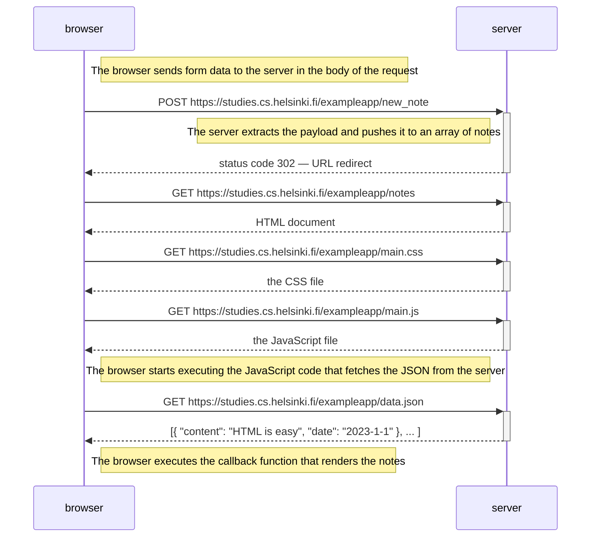

```mermaid
sequenceDiagram
    participant A as browser;
    participant B as server;
    
    Note right of A: The browser sends form data to the server in the body of the request;
    
    A ->> +B: POST https://studies.cs.helsinki.fi/exampleapp/new_note;

    Note left of B: The server extracts the payload and pushes it to an array of notes;

    B -->> -A: status code 302 — URL redirect;
    
    A ->> +B: GET https://studies.cs.helsinki.fi/exampleapp/notes;
    B -->> -A: HTML document;
    
    A ->> +B: GET https://studies.cs.helsinki.fi/exampleapp/main.css;
    B -->> -A: the CSS file;
    
    A ->> +B: GET https://studies.cs.helsinki.fi/exampleapp/main.js;
    B -->> -A: the JavaScript file;
    
    Note right of A: The browser starts executing the JavaScript code that fetches the JSON from the server;
    
    A ->> +B: GET https://studies.cs.helsinki.fi/exampleapp/data.json;
    B -->> -A: [{ "content": "HTML is easy", "date": "2023-1-1" }, ... ];
    
    Note right of A: The browser executes the callback function that renders the notes;
```
