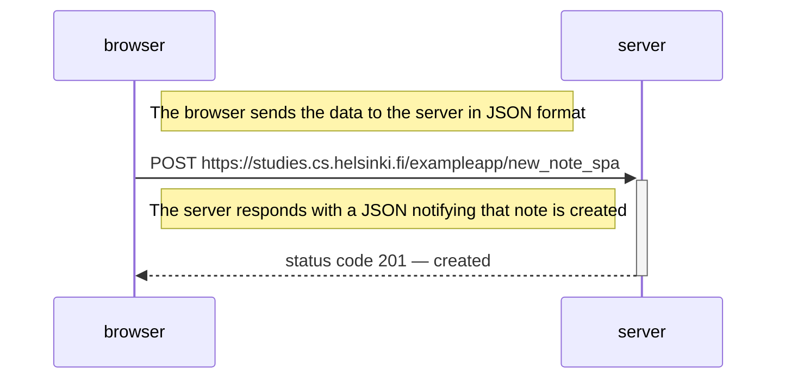

```mermaid
sequenceDiagram
    participant A as browser;
    participant B as server;
    
    Note right of A: The browser sends the data to the server in JSON format;
    
    A ->> +B: POST https://studies.cs.helsinki.fi/exampleapp/new_note_spa;

    Note left of B: The server responds with a JSON notifying that note is created;

    B -->> -A: status code 201 — created;
```
