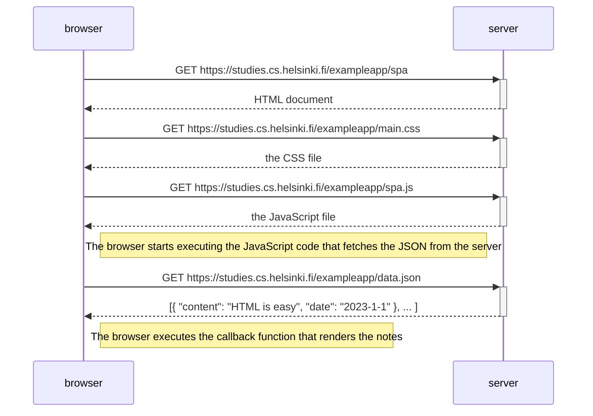

```mermaid
sequenceDiagram
    participant A as browser;
    participant B as server;
    
    A ->> +B: GET https://studies.cs.helsinki.fi/exampleapp/spa;
    B -->> -A: HTML document;
    
    A ->> +B: GET https://studies.cs.helsinki.fi/exampleapp/main.css;
    B -->> -A: the CSS file;
    
    A ->> +B: GET https://studies.cs.helsinki.fi/exampleapp/spa.js;
    B -->> -A: the JavaScript file;
    
    Note right of A: The browser starts executing the JavaScript code that fetches the JSON from the server;
    
    A ->> +B: GET https://studies.cs.helsinki.fi/exampleapp/data.json;
    B -->> -A: [{ "content": "HTML is easy", "date": "2023-1-1" }, ... ];
    
    Note right of A: The browser executes the callback function that renders the notes;
```
